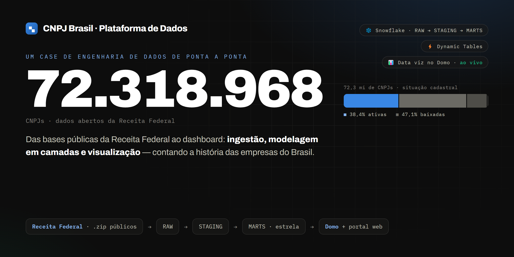
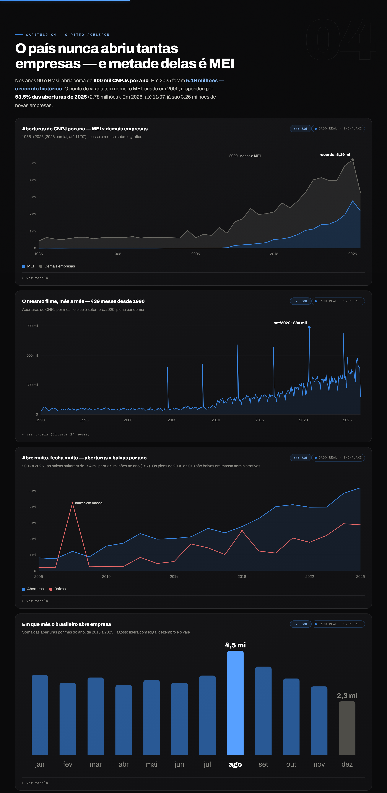
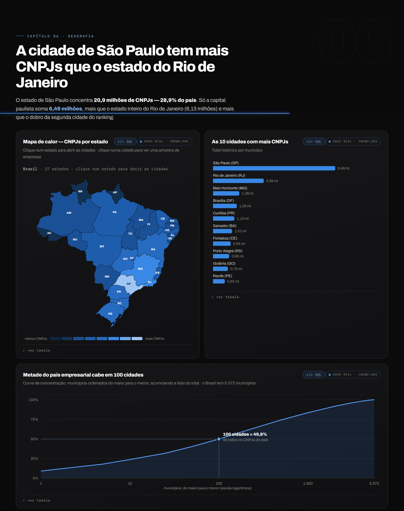
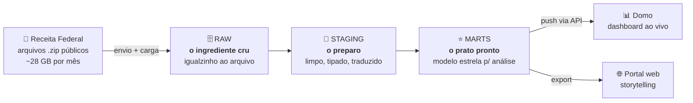
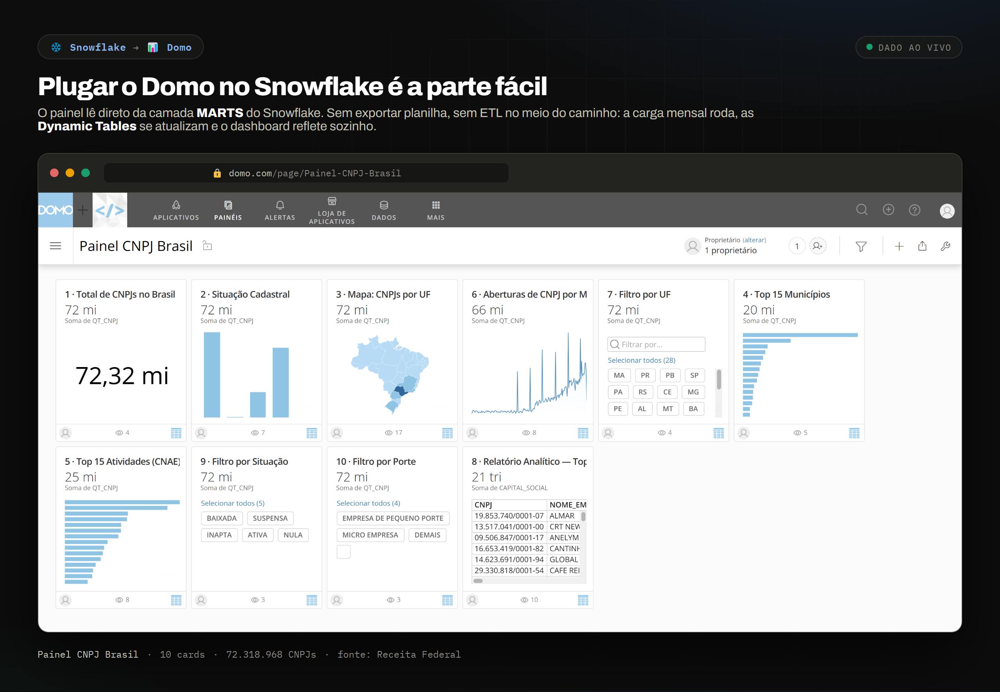
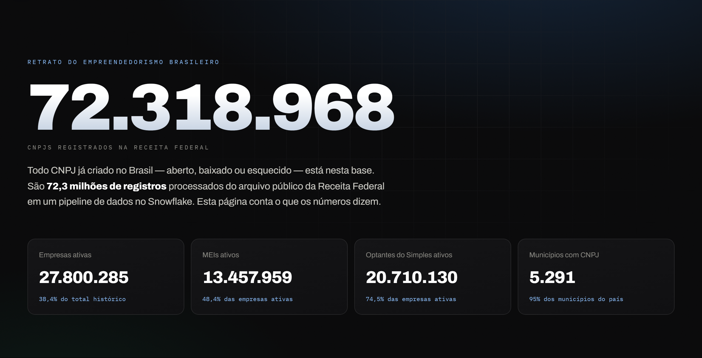
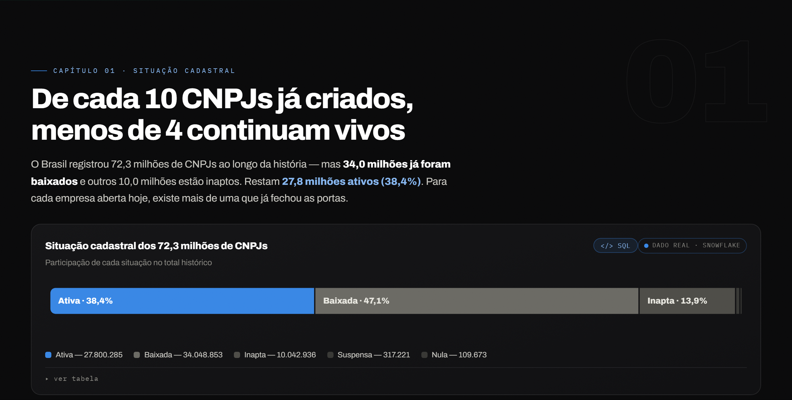
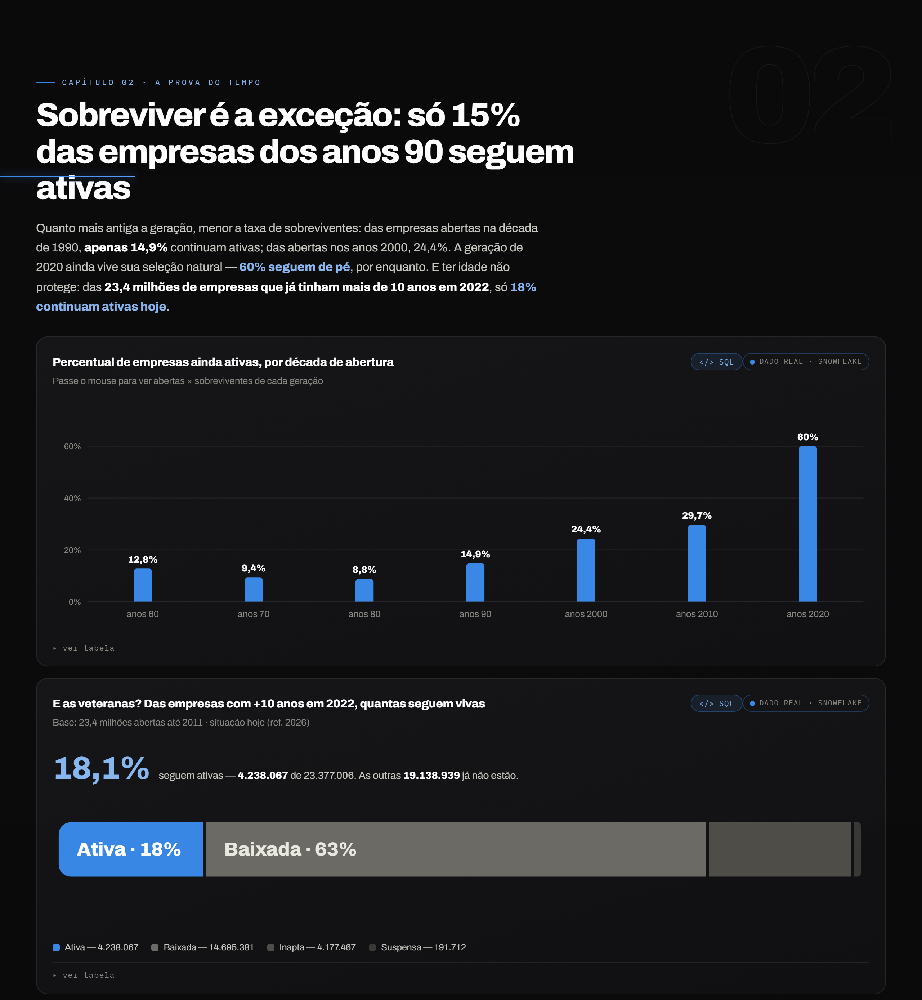
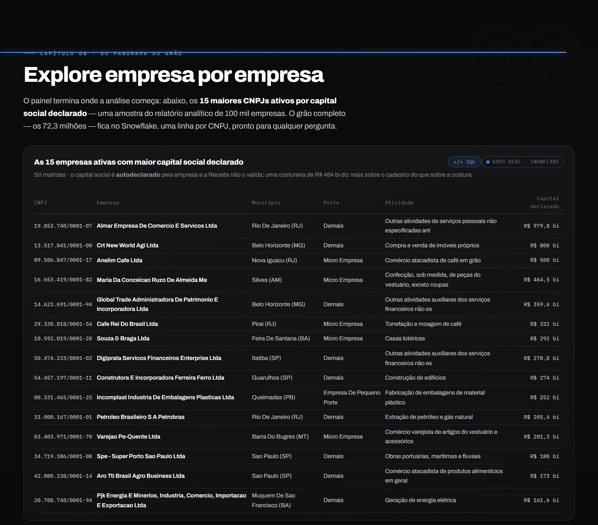

<div align="center">



# CNPJ Brasil · Plataforma de Dados

**Das bases públicas da Receita Federal ao dashboard — um case de engenharia de dados de ponta a ponta.**

Ingestão, modelagem em camadas e visualização dos **72,3 milhões de CNPJs** do Brasil, usando Snowflake e Domo.


### [🌐 Ver o portal ao vivo →](https://longarai.github.io/cnpj-brasil-plataforma-dados/portal/)

</div>

---

## 🧭 O que é isto (em uma frase)

Todo mês a Receita Federal publica, de graça, o **cadastro completo de todas as empresas do Brasil** — mais de 70 milhões de CNPJs. São arquivos enormes, brutos, difíceis de abrir no Excel. Este projeto pega esses arquivos, **organiza em um banco de dados na nuvem** e transforma tudo em **gráficos que contam uma história**.

> **Não conhece Snowflake?** Sem problema. Pense nele como um **banco de dados que mora na nuvem** — você joga os dados lá e faz perguntas em SQL, sem se preocupar com servidor. O **Domo** é a ferramenta que transforma o resultado dessas perguntas em **painéis e gráficos**. O resto deste README explica o caminho todo, passo a passo.

---

## 📊 O que os dados contam

Alguns números que saíram da base (referência de julho/2026):

- 🏢 **72,3 milhões** de CNPJs já registrados na história do país
- 💀 Só **38,4% continuam ativos** — para cada empresa viva, mais de uma já fechou
- 🚀 **2025 foi recorde**: 5,19 milhões de empresas abertas em um ano
- 🧑‍💼 E **metade delas é MEI** — o microempreendedor virou o motor do país
- 🏙️ A **cidade de São Paulo** (6,49 mi) tem mais CNPJs que o **estado do Rio de Janeiro** (6,13 mi)

### 🔍 E as análises que incomodam

- 📉 **A pejotização em um gráfico:** as aberturas cresceram **6× em 20 anos**, mas as empresas com **2+ sócios** (sociedade de verdade) ficaram **paradas em ~900 mil por mandato presidencial**. A fatia delas caiu de **1 em cada 3** (2003–2006) para **1 em cada 19** (hoje). O "boom de empreendedorismo" é, na real, um boom de CNPJ de uma pessoa só.
- ⏳ **Metade das empresas que fecham não passa de 3 anos e 4 meses** — e **28,8% não completam o primeiro ano**.
- 🏙️ **Metade do país empresarial cabe em 100 cidades**, de um total de 5.572 municípios.
- 🔁 **Rotatividade brutal:** as baixas por ano cresceram **15×** — de 194 mil (2006) para 2,9 milhões (2024).
- 📅 **Agosto é o mês em que mais se abre empresa** no Brasil; dezembro é o vale, com quase metade do movimento.

<div align="center">






</div>

---

## 🏗️ A arquitetura, em linguagem simples

O padrão é o **ELT** — *Extract, Load, Transform*: primeiro joga-se o dado cru dentro do banco, e só depois ele é transformado, **lá dentro, com SQL**. Aqui:

- **E**xtract — baixar os arquivos da Receita Federal
- **L**oad — subir os CSVs crus para o Snowflake (`PUT` + `COPY INTO`)
- **T**ransform — **as Dynamic Tables**, que fazem toda a camada de transformação

Os dados passam por **três camadas**. A ideia é a mesma de uma cozinha: os ingredientes chegam crus, são preparados, e só então viram o prato servido.



| Camada | O que é | Como funciona aqui |
|---|---|---|
| **RAW** | Dados **brutos**, idênticos ao arquivo original | Tabelas de texto puro + uma *procedure* que recarrega tudo todo mês |
| **STAGING** | Dados **tratados**: datas viram datas, códigos viram nomes | *Dynamic Tables* — **tabelas que se atualizam sozinhas** quando o RAW muda |
| **MARTS** | Dados **prontos para o painel**, em [modelo estrela](https://pt.wikipedia.org/wiki/Esquema_estrela) | Um fato central (`FATO_CNPJ`, 1 linha por CNPJ) + dimensões (CNAE, município, etc.) |

**A regra de ouro:** a *origem* organiza a entrada (RAW e STAGING), o *negócio* organiza a saída (MARTS). Amanhã, com 50 fontes de dados diferentes, continuam existindo só **3 bancos** — cada fonte nova é só um schema novo.

> 💡 **Por que "Dynamic Table"?** É uma tabela normal, mas com uma instrução do tipo *"fique sempre igual a esta consulta"*. Quando os dados de baixo mudam, ela se recalcula sozinha — **sem Airflow, sem cron, sem script de orquestração**. Você escreve o SELECT; o Snowflake cuida do resto. É por isso que o **T** do ELT, aqui, é só SQL.

<div align="center">


<sub>A corrente de atualização: quando a carga mensal toca o RAW, a onda percorre até os agregados sozinha.</sub>

</div>

### 📸 Quer ver por dentro?

**[docs/o_pipeline_por_dentro.md](docs/o_pipeline_por_dentro.md)** percorre o caminho do dado com **telas reais do ambiente**: os arquivos brutos chegando ao stage, a Dynamic Table que faz a limpeza, o grafo que se atualiza sozinho, a linhagem completa gerada pelo próprio Snowflake e a consulta final respondendo em 378 milissegundos.

### ✅ E os números, dá para confiar?

**[docs/qualidade_dos_dados.md](docs/qualidade_dos_dados.md)** mostra a conferência: todo indicador publicado foi **recalculado na fonte e comparado** com o que está no portal (12 de 12 conferem, sem divergência), além das armadilhas reais do cadastro público — como o capital social ser declarado por empresa e se repetir em cada filial, ou os R$ 464 bilhões de uma costureira do Amazonas.

---

## 🔄 A carga mensal — 2 cliques

O trabalho recorrente é o mais simples possível: baixar os arquivos do mês e dar **dois cliques** em um `.bat`.

```text
1. Baixar os .zip do mês em uma pasta local  (dados públicos da Receita Federal)
2. Dois cliques em  ingestao/carga_mensal.bat
       ├─ limpa os arquivos do mês anterior
       ├─ envia os novos para o Snowflake (compactado, em paralelo)
       └─ chama a procedure que recarrega as 10 tabelas
3. STAGING e MARTS se atualizam sozinhas (Dynamic Tables)
4. Rodar  entrega/envia_datasets_domo.py  → o dashboard reflete o mês novo
```

Passo a passo detalhado (escrito para leigo rodar): **[docs/carga_mensal_passo_a_passo.md](docs/carga_mensal_passo_a_passo.md)**

---

## 🎨 A entrega: dashboard + portal

O resultado sai em dois formatos, cada um para um público:

**1. Dashboard no Domo** — painel interativo com mapa do Brasil, rankings e fatiadores (filtros que cruzam todos os gráficos por UF, situação e porte). Os dados vêm do Snowflake e o painel atualiza junto com a carga mensal.

<div align="center">



</div>

**2. Portal web de storytelling** — uma página **100% offline** (arquivo único, sem depender de nada) que conta a história dos números em 8 capítulos, com gráficos próprios em SVG. É o `portal/index.html` deste repositório. Três detalhes que valem a visita:

- **Botão `</> SQL` em cada gráfico** — abre a consulta exata que gerou aquele número, com opção de copiar. Nada de "confie em mim": o caminho do dado está à vista.
- **Mapa de calor com drill** — o contorno real do Brasil; clique num estado para abrir as maiores cidades como bolhas, e numa cidade para ver empresas reais (CNPJ, CNAE, CEP e capital social).
- **Navegação por capítulos** — índice lateral que acompanha a leitura, com barra de progresso.

<div align="center">





</div>

<div align="center">






</div>

> 🌐 **Portal no ar:** **[longarai.github.io/cnpj-brasil-plataforma-dados/portal](https://longarai.github.io/cnpj-brasil-plataforma-dados/portal/)** (via GitHub Pages). Também abre localmente — é só dar dois cliques em `portal/index.html`, o arquivo é autossuficiente.

---

## 📁 Estrutura do repositório

```
.
├── sql/                      # os scripts que constroem o banco (rodar em ordem, 01 → 08)
│   ├── 01_bancos_e_schemas.sql
│   ├── 02_file_format_e_stage.sql
│   ├── 03_tabelas_raw_receita_federal.sql
│   ├── 04_procedure_carga_mensal.sql
│   ├── 05_staging_receita_federal.sql      # camada STAGING (Dynamic Tables)
│   ├── 06_marts_empresas.sql               # camada MARTS (modelo estrela)
│   ├── 07_views_top15_domo.sql
│   └── 08_view_detalhe_domo.sql
├── ingestao/
│   ├── carga_mensal.py       # envia os arquivos e dispara a carga
│   └── carga_mensal.bat      # a carga em 2 cliques
├── entrega/
│   └── envia_datasets_domo.py  # empurra os datasets para o Domo (via API)
├── portal/
│   └── index.html            # o portal de storytelling (offline, arquivo único)
├── docs/
│   ├── o_pipeline_por_dentro.md        # o caminho do dado, com telas reais do Snowflake
│   ├── qualidade_dos_dados.md          # conferência dos números e armadilhas do cadastro
│   ├── arquitetura.md
│   ├── carga_mensal_passo_a_passo.md
│   └── regras_negocio_referencia.md
├── config.exemplo.py         # modelo de configuração (copie para config.py)
└── imagens/
```

---

## ⚙️ Como reproduzir

Você vai precisar de uma conta Snowflake (o [trial gratuito](https://signup.snowflake.com/) serve) e Python 3.10+.

```bash
# 1. Clonar
git clone https://github.com/longarai/cnpj-brasil-plataforma-dados.git
cd cnpj-brasil-plataforma-dados

# 2. Instalar dependências
pip install snowflake-connector-python requests

# 3. Configurar credenciais (o config.py fica fora do Git)
cp config.exemplo.py config.py     # depois edite com seus dados

# 4. Construir o banco: rodar os scripts de sql/ na ordem (01 → 08) no Snowflake

# 5. Baixar os arquivos do mês da Receita Federal e rodar a carga
python ingestao/carga_mensal.py
```

> 🔒 **Segurança:** nenhuma credencial vive no código. Tudo fica em `config.py`, que está no `.gitignore` e **nunca** vai para o repositório. Este projeto usa **apenas dados públicos** — nada aqui é sigiloso.

---

## 🧰 Stack

| Camada | Ferramenta |
|---|---|
| Armazenamento e processamento | **Snowflake** (RAW / STAGING / MARTS, Dynamic Tables) |
| Ingestão | **Python** (`snowflake-connector-python`, `PUT` + `COPY INTO`) |
| Transformação | **SQL** (Dynamic Tables, modelo estrela) |
| Visualização | **Domo** (push via API) + **portal HTML/SVG** próprio |

---

## 📚 Fonte dos dados

Dados abertos do CNPJ, publicados mensalmente pela Receita Federal:
**[gov.br/receitafederal (dados públicos CNPJ)](https://www.gov.br/receitafederal/pt-br/assuntos/orientacao-tributaria/cadastros/consultas/dados-publicos-cnpj)**

Dados de domínio público. Código sob licença [MIT](LICENSE).

---

<div align="center">
<sub>Feito por <b>Gabriel Longarai</b> · engenharia de dados de ponta a ponta, com dados públicos.</sub>
</div>
