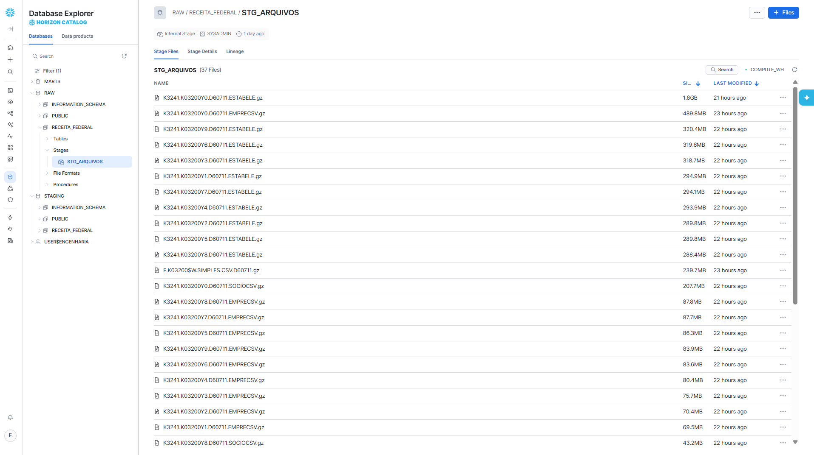
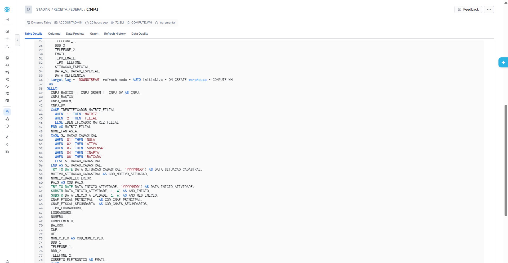
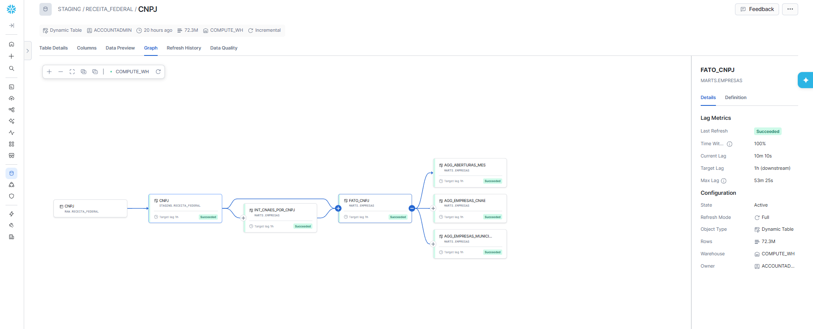
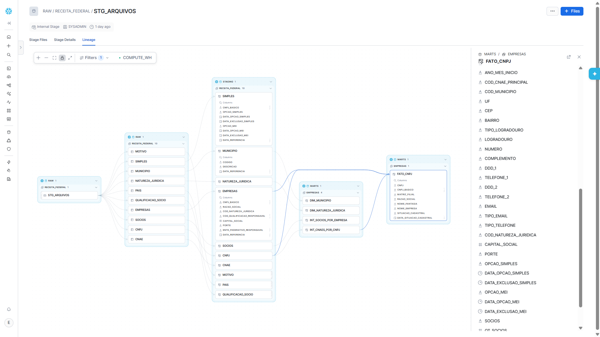
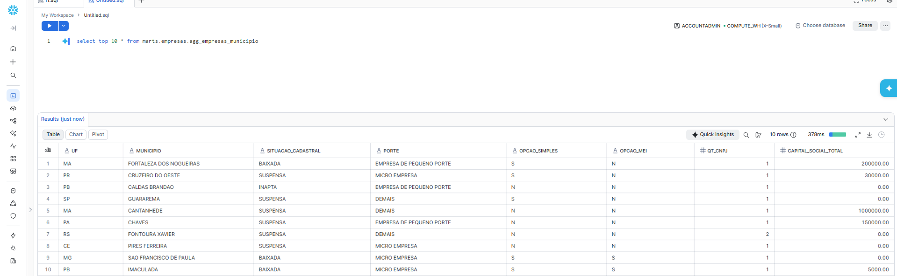

# O pipeline por dentro — o que acontece dentro do Snowflake

Esta página mostra o caminho do dado com telas reais do ambiente, na ordem em que ele
percorre o pipeline: do arquivo bruto da Receita Federal até a consulta pronta para o painel.

É a mesma sequência do **ELT** — *Extract, Load, Transform* — descrita no
[README](../README.md): primeiro o dado entra cru, e só depois é transformado, **dentro do
banco, com SQL**.

---

## 1. Load — os arquivos brutos chegam ao stage



O **stage** é a área de pouso do Snowflake: um espaço de arquivos dentro do próprio banco.
O script de carga envia para lá os arquivos do mês (`PUT`) e eles ficam guardados até a
carga seguinte, servindo de cópia do que foi processado.

O que a tela mostra:

- `RAW / RECEITA_FEDERAL / STG_ARQUIVOS` — **37 arquivos**, já compactados em `.gz` pelo envio
- Os maiores são os de estabelecimentos (`ESTABELE`, **1,8 GB** o maior deles), seguidos de
  empresas (`EMPRECSV`) e sócios (`SOCIOCSV`)
- `D60711` no nome é a data de referência da competência: **11/07/2026**
- À esquerda, os **três bancos** da arquitetura já visíveis: `RAW`, `STAGING` e `MARTS`

---

## 2. Transform — uma Dynamic Table faz a limpeza



Aqui está o **T do ELT**. A tabela `STAGING.RECEITA_FEDERAL.CNPJ` é uma **Dynamic Table**:
você escreve um `SELECT` e declara que o resultado deve ficar sempre atualizado — o Snowflake
cuida da atualização sozinho.

Repare no cabeçalho da tela:

| O que aparece | O que significa |
|---|---|
| `Dynamic Table` | não é uma tabela comum: é mantida pelo próprio banco |
| `72.3M` | 72,3 milhões de linhas — uma por CNPJ |
| `Incremental` | reprocessa **só o que mudou**, não a tabela inteira |
| `target_lag = 'DOWNSTREAM'` | atualiza quando quem depende dela precisar |
| `COMPUTE_WH` | o warehouse (a máquina) que executa a atualização |

E no corpo do `SELECT`, o tratamento que transforma o dado cru em dado utilizável:

- **Monta o CNPJ completo**: `CNPJ_BASICO || CNPJ_ORDEM || CNPJ_DV AS CNPJ`
- **Traduz códigos em texto**: `'1' → MATRIZ`, `'2' → FILIAL`; `'02' → ATIVA`, `'08' → BAIXADA`
- **Converte texto em data**: `TRY_TO_DATE(DATA_INICIO_ATIVIDADE, 'YYYYMMDD')` — o `TRY_` evita
  que uma data inválida quebre a carga inteira
- **Cria campos derivados**: `ANO_INICIO` e `ANO_MES_INICIO`, extraídos da data de abertura

É tudo SQL. Não existe script de transformação rodando por fora.

---

## 3. A cadeia se atualiza sozinha



Esta é a tela que melhor explica por que as Dynamic Tables substituem um orquestrador.
O grafo mostra a **corrente de dependências**, da esquerda para a direita:

```
RAW.RECEITA_FEDERAL.CNPJ  →  STAGING.RECEITA_FEDERAL.CNPJ  →  INT_CNAES_POR_CNPJ
                                                           →  MARTS.EMPRESAS.FATO_CNPJ
                                                                 ├→ AGG_ABERTURAS_MES
                                                                 ├→ AGG_EMPRESAS_CNAE
                                                                 └→ AGG_EMPRESAS_MUNICIPIO
```

Quando a carga mensal atualiza o RAW, **a onda percorre a corrente inteira sozinha**. Cada
caixa verde é uma atualização que terminou com sucesso (`Succeeded`).

No painel da direita, as métricas do `FATO_CNPJ`:

- **Current Lag: 10m 10s** — o atraso real em relação à origem naquele momento
- **Target Lag: 1h (downstream)** — o compromisso de frescor declarado
- **Rows: 72,3M** e **State: Active**

Nenhum Airflow, nenhum cron, nenhuma DAG. O compromisso é declarado; o banco cumpre.

---

## 4. A linhagem completa, do arquivo ao fato



A mesma história, agora do início: o Snowflake desenha sozinho a **linhagem** (*lineage*) —
de onde cada dado veio e para onde foi. Da esquerda para a direita:

1. **`STG_ARQUIVOS`** — o stage com os arquivos
2. **`RAW.RECEITA_FEDERAL`** — as **10 tabelas brutas** (CNPJ, EMPRESAS, SOCIOS, SIMPLES e os
   6 domínios: MOTIVO, MUNICIPIO, NATUREZA_JURIDICA, PAIS, QUALIFICACAO_SOCIO, CNAE)
3. **`STAGING.RECEITA_FEDERAL`** — as mesmas 10, agora tipadas e traduzidas
4. **`MARTS.EMPRESAS`** — as dimensões (`DIM_MUNICIPIO`, `DIM_NATUREZA_JURIDICA`) e as
   tabelas intermediárias (`INT_SOCIOS_POR_EMPRESA`, `INT_CNAES_POR_CNPJ`) convergindo para
   o fato central **`FATO_CNPJ`**

À direita, as colunas do `FATO_CNPJ` — o resultado de todo o caminho: uma linha por CNPJ, com
endereço, CNAE, situação, porte, capital social, opção pelo Simples e pelo MEI, sócios.

Essa documentação não foi desenhada à mão: **é gerada pelo próprio Snowflake**, a partir das
dependências reais entre os objetos.

---

## 5. O resultado: uma consulta simples na camada de negócio



O fim da linha é o começo do trabalho de quem analisa. Depois de todo o caminho, responder
uma pergunta é isto:

```sql
select top 10 * from marts.empresas.agg_empresas_municipio
```

**378 milissegundos**, num warehouse do menor tamanho possível (`X-Small`). O agregado já
chega pronto — UF, município, situação cadastral, porte, opção pelo Simples e pelo MEI,
quantidade de CNPJs e capital social somado.

É esse resultado que abastece o dashboard no Domo e o portal deste repositório. Quem consome
não precisa saber que existiu um CSV de 28 GB com códigos numéricos: a complexidade ficou
resolvida uma vez, na modelagem.

---

## Em resumo

| Etapa | Onde acontece | O que garante |
|---|---|---|
| **Extract** | fora do banco | baixar os arquivos publicados pela Receita Federal |
| **Load** | `RAW` + stage interno | `PUT` e `COPY INTO`, sem transformar nada |
| **Transform** | `STAGING` e `MARTS` | Dynamic Tables encadeadas, só SQL |
| **Serve** | `MARTS` | agregados prontos, respondendo em milissegundos |
